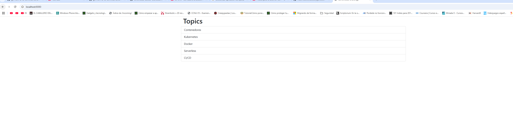
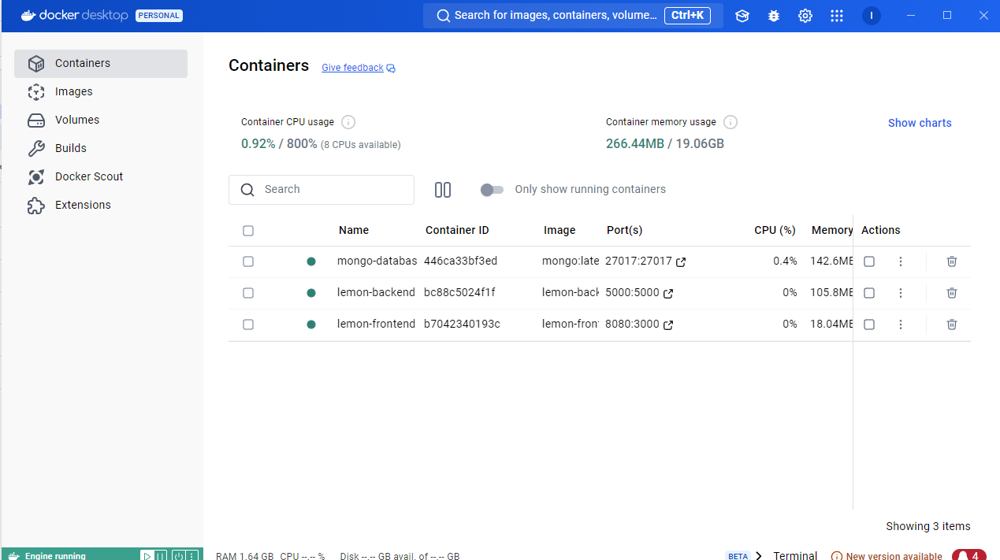

PASOS PARA LA REALIZACIÓN DEL EJERCICIO NUMERO 1.

=========
PRIMERO CREAMOS LA RED

 docker network create lemoncode-challenge

 ===============

 PARA LA CREACIÓN DE MONGO DB

 ================
 CREAMOS EL VOLUMEN

 docker volume create mongodb-volume    

 CREAMOS EL CONTENEDOR USANDO LA ULTIMA IMAGEN DE MONGO 

 docker run --name mongo-database --network lemoncode-challenge -p 27017:27017 --mount source=mongodb-volume,target=/data/db -d mongo:latest

 UNA VEZ CREADO , CON MONGO DB COMPASS CREAMOS LA BASE DE DATOS
 

=====================
 PARA LA CREACIÓN DEL BACKEND

 ====================

 USANDO NODE
 PARA EL BACKED CAMBIO EN package.json LO SIGUIENTE
 "start": "ts-node src/app" POR "start": "node dist/app.js"
 CREO EL DOCKERFILE (ESTA EN EL FICHERO)
 HAGO UN BUILD
 docker build -t lemon-backend .
 CORRO EL CONTENDERO
 docker run -d  --name lemon-backend --network lemoncode-challenge  -e DATABASE_URL=mongodb://mongo-database:27017  -e DATABASE_NAME=TopicstoreDb -p 5000:5000  lemon-backend
 FUNCIONA

 PARA LA CREACIÓN DEL FRONTED

 MODIFICO EL FICHERO server.js 
 CREO EL DOCKERFIELD
 HAGO EL BUILD
 docker build -t lemon-backend
 CORRO EL CONTENDOR
 docker run -d  --name lemon-backend   --network lemoncode-challenge  -e MONGO_URL=mongodb://mongo-database:27017  -p 5000:5000  lemon-backend 
 FUNCIONA
 

 NOTA: PARA LA CREACIÓN DE DODKCERFILE SE USA
 1. EL ASISTENE DE DOCKERFILE DE VISUAL
 2. COPILOT

 LOS TRES CONTENEDORES CORRIENDO

 